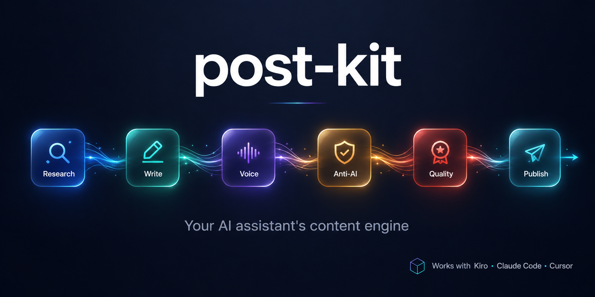
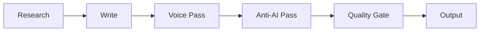

<div align="center">

# post-kit



**Your AI assistant's content engine.** Research, write, and publish posts that sound like you — zero code, any niche, any platform.

[](LICENSE)
[](#-quick-start)
[](#-how-it-works)
[](https://github.com/Huzaifa-ali/post-kit/generate)

[Quick Start](#-quick-start) · [How It Works](#-how-it-works) · [Modules](#-modules) · [Examples](#-examples) · [Contributing](#-contributing)

</div>

---

## What Comes Out

I said _"write a post about why most people quit the gym in January"_ — here's what the pipeline produced:

> 80% of New Year gym memberships are abandoned by February. Not because people are lazy. Because the goal was wrong.
>
> "Get in shape" isn't a goal. It's a vibe. You can't measure a vibe. You can't fail at a vibe clearly enough to course-correct.
>
> Here's what actually sticks:
>
> → "Squat my bodyweight by March" — specific, testable, has a deadline
> → "Go 3x per week for 8 weeks" — system, not outcome
> → "Lose 4kg before my trip in April" — tied to something real
>
> The people still in the gym in March didn't have more discipline. They had a clearer target.
>
> What was the goal that actually got you consistent?

No "delve." No "it's worth noting." No "in today's rapidly evolving landscape." Just a real person with real opinions sharing something useful — in their voice, for their audience.

---

## 🚫 The Anti-AI Pass (Before → After)

<table>
<tr>
<th>❌ Before (raw AI output)</th>
<th>✅ After (anti-AI pass)</th>
</tr>
<tr>
<td>

It's worth noting that in today's rapidly evolving fitness landscape, leveraging a comprehensive gym routine is crucial for fostering long-term wellness. Furthermore, implementing a robust workout strategy empowers individuals to streamline their health journey seamlessly.

</td>
<td>

80% of New Year gym memberships are abandoned by February. Not because people are lazy. Because the goal was wrong. "Get in shape" isn't a goal. It's a vibe. You can't measure a vibe.

</td>
</tr>
</table>

The anti-AI pass runs on **every** post. It catches 50+ banned words, AI sentence patterns, hedging language, and robotic structure — then rewrites until it sounds like a human wrote it.

---

## ✨ Features

| Feature | What it does |
|---------|-------------|
| 🎙️ **Voice matching** | Learns how you sound — posts read like YOU wrote them |
| 🚫 **Anti-AI filter** | Automatically removes robotic language, every post, no exceptions |
| 🔬 **Research-backed** | Pulls from Reddit, HackerNews, RSS, web — cross-validates sources |
| 📦 **Modular** | Only enable what you need (visuals, memes, news, video, analytics) |
| 📱 **Multi-platform** | LinkedIn, X, YouTube, Newsletter — one post adapts to many |
| ⚡ **5-minute setup** | Guided onboarding — answer 10 questions, start posting immediately |

---

## 🚀 Quick Start

### 1. Get your own copy

<a href="https://github.com/Huzaifa-ali/post-kit/generate">
  
</a>

Click **"Use this template"** on GitHub to create your own copy. Or clone directly:

```bash
git clone https://github.com/Huzaifa-ali/post-kit.git my-content-pipeline
cd my-content-pipeline
```

### 2. Open in your AI tool

Open the folder in **any** AI coding tool:

| Tool | How |
|------|-----|
| **Kiro** | File → Open Folder → select the cloned folder |
| **Claude Code** | `cd my-content-pipeline` then run `claude` |
| **Cursor** | File → Open Folder → select the cloned folder |
| **Windsurf / Cline / Copilot** | Same — open the folder, start chatting |

The AI reads `AGENTS.md` automatically and becomes your content pipeline. No extensions, no config files, no setup commands.

### 3. Set up your pipeline (3 minutes)

Start a conversation. The AI will greet you:

> "Welcome to post-kit! Guided or manual setup?"

Pick **guided**. The AI asks you 10 simple questions:

1. What's your niche? _(fitness, crypto, marketing, cooking — anything)_
2. How do you want to sound? _(casual, professional, savage, educational)_
3. What platforms? _(LinkedIn, X, both, others)_
4. What do you post about? _(your topics + rough percentage split)_
5. Do you use images?
6. Do you do memes/humor?
7. News-based or evergreen content?
8. Where does your audience hang out online?
9. How often do you post?
10. Your timezone?

From your answers, the AI generates your personalized config files in `my-niche/` — your voice profile, content rules, sources, hashtags, and active modules. You own all of it.

### 4. Start posting

Say any of these:

| You say | What happens |
|---------|-------------|
| "Write a post about [topic]" | Full pipeline runs → finished post in `posts/` |
| "What's trending in my space?" | Scouts Reddit, HN, RSS for hot topics |
| "Roast [company/topic]" | Meme pipeline (if humor is enabled) |
| "Help me improve my hooks" | Brainstorms better opening lines with you |
| "Repurpose this for X" | Adapts a LinkedIn post for Twitter format |

Every post goes through: **Research → Write → Voice Match → Anti-AI Filter → Quality Gate → Output.** You get a publish-ready post that sounds like you wrote it.

---

## ⚙️ How It Works



Every post goes through this pipeline automatically:

1. **Research** — Finds trending topics from your configured sources (Reddit, HN, RSS)
2. **Write** — Drafts following your content rules (length, structure, hooks)
3. **Voice Pass** — Rewrites to match YOUR voice profile
4. **Anti-AI Pass** — Strips banned words, AI patterns, robotic structure _(mandatory, always on)_
5. **Quality Gate** — Checks hook strength, one-idea rule, save/share test, platform compliance
6. **Output** — Saves to `posts/` with metadata, ready to publish

---

## 📦 Modules

Enable by telling the AI "I want to do [feature]" or by dropping a `.md` file in your config folder.

| Module | What it does |
|--------|-------------|
| **News Scout** | Discovers trending topics, cross-validates across sources |
| **Visual System** | Recommends the right image type for each post |
| **Memes** | Humor, roasts, meme formats with calibration levels |
| **Image Prompts** | Generates AI image prompts when no real image fits |
| **Video Content** | Short-form video specs, scripts, storyboards |
| **Carousel** | Multi-slide content creation |
| **Repurpose** | Adapts one post for multiple platforms |
| **Analytics** | Tracks what works, feeds insights back into the pipeline |

Don't need memes? Don't enable it. Want analytics later? Just ask.

---

## 📂 Project Structure

```
post-kit/
├── engine/
│   ├── core/           # Pipeline, onboarding, quality gates, anti-AI pass
│   ├── modules/        # Optional capabilities (news, memes, visuals, etc.)
│   └── platforms/      # Platform-specific rules (LinkedIn, X, etc.)
├── examples/
│   └── ai-tech/        # Complete working niche pack (study or copy)
├── my-niche/           # YOUR config lives here (created during setup)
├── posts/              # Generated posts go here
└── docs/               # Full documentation
```

---

## 🎯 Examples

The [`examples/ai-tech/`](examples/ai-tech/) folder contains a complete, proven niche pack for AI/tech content. It includes voice profile, content rules, sources, hashtags, and active modules — everything configured and working.

Use it to:
- Study how the pieces connect
- Copy it as a starting template for your own niche
- See what good configuration looks like

---

## 🤝 Contributing

We welcome contributions — especially:

- **Niche packs** — Share your working config for others in your niche
- **New modules** — Add capabilities anyone can use
- **Platform files** — Research and document new platforms
- **Anti-AI patterns** — Found a new AI tell? Add it

See [docs/contributing.md](docs/contributing.md) for guidelines.

---

## 🗺️ Roadmap

- [x] Core pipeline (Research → Write → Voice → Anti-AI → Quality Gate → Output)
- [x] Guided onboarding (10-question setup)
- [x] LinkedIn platform support
- [x] X (Twitter) platform support
- [x] 8 optional modules (news, memes, visuals, video, carousel, analytics, repurpose, image prompts)
- [ ] Community niche packs (fitness, crypto, SaaS, real estate, marketing)
- [ ] YouTube Community platform file
- [ ] Newsletter platform file
- [ ] Blog platform file
- [ ] Thread/series module (multi-post storylines)
- [ ] Scheduling integration suggestions (best time to post per platform)
- [ ] A/B hook testing (generate 3 hooks, pick the strongest)
- [ ] Voice calibration from existing posts (paste 5 posts, extract your voice automatically)

Have an idea? [Open a feature request](https://github.com/Huzaifa-ali/post-kit/issues/new?template=feature_request.md).

---

## 📄 License

[MIT](LICENSE) — use it however you want.
